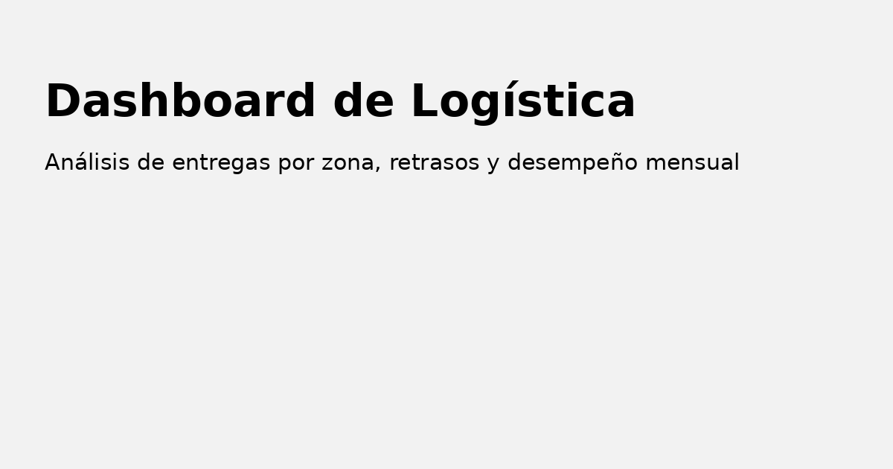

## ⚠️ Requisitos para abrir este proyecto

Este archivo `.pbix` está conectado a una base de datos local SQL Server (LocalDB).  
Para replicar el análisis, se requiere tener instalada la instancia `(localdb)\MSSQLLocalDB` y la base `LogisticaDB` con las tablas `ordenes`, `entregas`, `zonas` y `transportistas`.

Se incluye el script SQL completo para crear la base y poblarla con datos históricos:
📄 `logistica_db_completa.sql`

## 📥 Reutilización sin conexión a base de datos

Para facilitar la revisión, se incluyen archivos `.csv` con los datos utilizados.  
Puedes abrir el archivo `.pbix`, eliminar la conexión SQL original y cargar estos archivos como nuevas tablas en Power BI.

Archivos disponibles:
- `ordenes.csv`
- `entregas.csv`
- `zonas.csv`
- `transportistas.csv`

# 📦 Dashboard de Logística – Power BI

Este proyecto presenta un dashboard interactivo de análisis logístico utilizando Power BI, enfocado en la gestión de entregas por zona, transportista y desempeño mensual.

---

## ✨ Objetivo

Visualizar de forma clara y ejecutiva el comportamiento de las entregas, identificando:
- Cantidad total de entregas
- Cumplimiento de plazos
- Retrasos por zona o empresa
- Tendencias mensuales

---

## 🔧 Tecnologías utilizadas

- ⚙️ **Power BI Desktop**
- 🧩 **SQL Server LocalDB**
- 📊 **DAX** para medidas dinámicas
- 🔁 **Power Query** para transformación de datos

---

## 📊 KPIs y visuales incluidos

| Métrica                      | Descripción                                      |
|-----------------------------|--------------------------------------------------|
| Total de Entregas           | Total de órdenes procesadas                     |
| % Entregas a Tiempo         | Entregas que llegaron sin retraso               |
| Retraso Promedio            | Días promedio de retraso por entrega            |
| % Entregas con Retraso      | Porcentaje de entregas que no cumplieron plazo  |

Visuales principales:
- **Barras apiladas** por zona y estado de entrega
- **Gráfico combinado** por mes: volumen + retraso promedio
- **Tabla resumen** por zona y transportista

---

## 🖼 Captura de dashboard

---

## 📂 Estructura de datos

- **ordenes**: contiene la fecha y destino de cada entrega
- **entregas**: estado, retraso y fecha real de entrega
- **transportistas** y **zonas**: tablas de dimensión

---

## 🚀 Cómo usar

1. Descargar archivo `.pbix`
2. Conectar a SQL Server LocalDB si se desea replicar
3. Explorar visuales y filtros
4. Adaptar a otras industrias logísticas

---

## 🗃 Script de base de datos

Se incluye el archivo `logistica_db_completa.sql` para crear la base de datos `LogisticaDB` en SQL Server LocalDB.

Este script:
- Elimina la base si ya existe
- Crea las tablas `zonas`, `transportistas`, `ordenes`, y `entregas`
- Inserta datos simulados para análisis logístico

### 🔁 ¿Cómo usarlo?

1. Abre **SQL Server Management Studio (SSMS)**
2. Conéctate a `(localdb)\MSSQLLocalDB`
3. Abre el archivo `logistica_db_completa.sql`
4. Ejecuta todo (Ctrl + A > F5)

## 👨‍💻 Autor

**Matías Echeverría**  
Ingeniero en Informática | Power BI Analyst  
[LinkedIn](https://www.linkedin.com/in/mat%C3%ADas-echeverr%C3%ADa-c/) | GitHub: `matecheverria`
